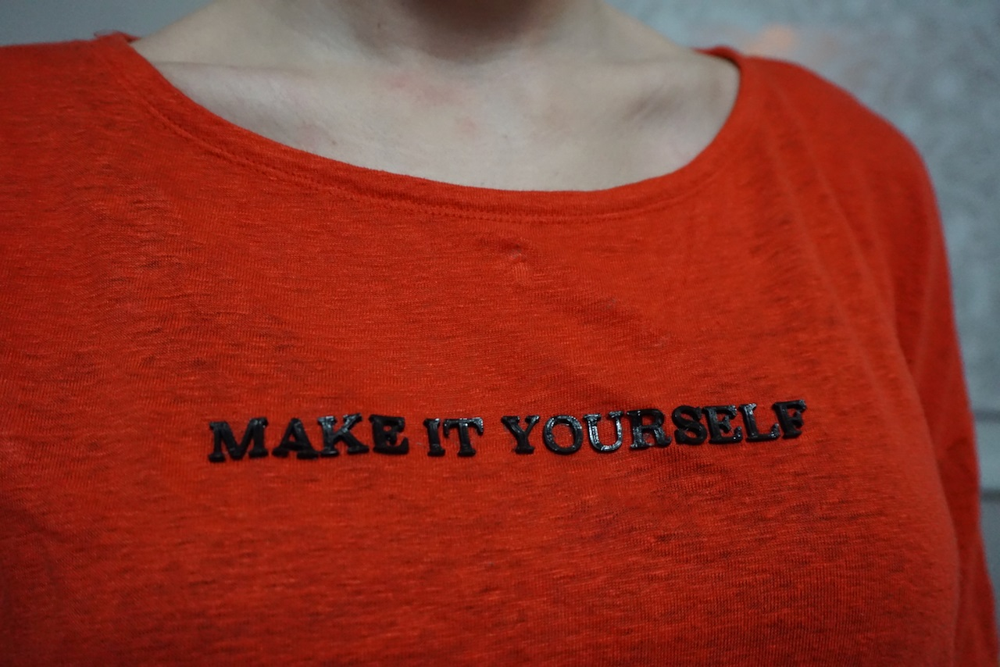

## Design

The first step, as with all 3D printing, is obtaining a digital model of your 3D design. For this tutorial, we used Fusion 360 modelling software to write the text ‘Make it Yourself’, and extruded it to a height of 2 mm. We also used open-source models from Thingiverse of a [heart](https://hsmag.cc/hTxzNp){:target="_blank"} and [spikes](https://hsmag.cc/ZDNHSp){:target="_blank"}. 

Whether you decide to make your own design or use an existing model, you will end up with an STL file that is now ready for slicing. 

--- collapse ---
---
title: Different fabrics
---
For this tutorial, we experimented with cotton, satin, denim, and linen. They had slightly different properties, but all produced wearable prints. We even threw them in the wash, inside out, and surprisingly, the smaller parts stayed on (although the large spike didn’t).
- **Cotton**: Warping: medium; Attachment: good; Tidiness of first layer: Yes
- **Satin**: Warping: low; Attachment: very good; Tidiness of first layer: No
- **Denim**: Warping: medium; Attachment: poor; Tidiness of first layer: Yes
- **Linen**: Warping: low; Attachment: good; Tidiness of first layer: Yes
--- /collapse ---

