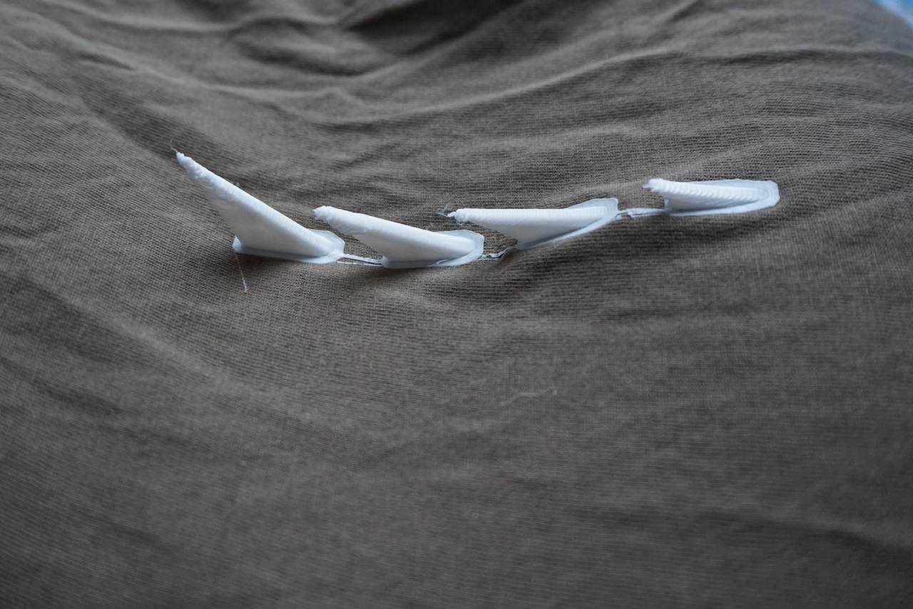

## Preparing the printer
The trick to 3D printing directly onto fabric is preparing your 3D printer for the task. Everything depends on the nozzle of the printer being just the right height above the fabric. Too close, and it will scratch the fabric; too far, and it won’t lay down the first layer (and all following layers!) properly, resulting in a tangled mess and residue on your fabric. 

Fabrics have some thickness, which will change based on the type of fabric, and throw off your printer’s calibration. So, here is our general method for getting your model to print safely onto any fabric. 

### Step 1: Safety offset! 
Before you do anything with the fabric, first and foremost, adjust the offset on your printer. Think of it like this: typically, your printer is ‘zeroed’ at the point where the tip of the nozzle just about touches the print bed. If your thick fabric were on the print bed at this point, the nozzle would come down and press into it, likely damaging the fabric with a hole. So firstly, we will lower the offset (‘the zero point’) by around three times the thickness of your fabric. This increases the distance between the print bed and the nozzle. We chose to lower the offset to -3 mm for all our prints, which we like to call ‘the safety offset’. 

Most modern firmware will allow you to change the offset on your 3D printer. If you have old firmware on your machine with no offset capability, we wouldn’t recommend printing directly on fabric. Make sure you update your firmware first!

### Step 2: Position fabric
Now that you’ve set your safety offset, place your fabric on the print bed. 

Always test on some scrap fabric before you attempt to print on your favourite clothing. We placed the fabric evenly on the print bed, and attached it around the perimeter with several bulldog clips. Pull the fabric as taut as possible on all sides, to prevent it from sliding around on the print bed. Make sure the clips won’t be in the way of your extruder as it travels to the start point. 

Position the fabric so that the excess hangs to the most unused part of your printer — away from the extruder and any moving rods. 

With a Witbox printer, the nozzle moves in relation to the print bed, whereas with other printers, the print bed will move in relation to the nozzle. This latter mechanism wouldn’t be ideal for printing on fabric because the excess fabric would get dragged around and likely get caught in the printer’s mechanism.

### Step 3: Tune the offset
Now, with your fabric securely on the print bed, we need to fine-tune the offset again to make sure the nozzle is perfectly positioned above the fabric for the best 3D printing. 

Because you have done a safety offset in Step 1, the distance between the tip of the nozzle and your fabric should be quite large. Now, we are going to gradually reduce this distance by upping the offset. This should bring the tip of the nozzle and print bed closer together. How far up you go will all depend on the thickness of your fabric, (eg denim vs satin). 

How do you tell when the distance is perfect? Wedge a regular A4 sheet of copy paper between the nozzle and the fabric as you keep upping the offset. Move the paper back and forth until you start to feel some serious resistance, but you can still move the paper back and forth. This step is more of an art than a science, but some experimentation will give you a good feel for it. 
   
Once you have adjusted the offset to perfection, you will also need to level the print bed. This ensures that the distance between the tip of the nozzle and the print bed is the same on all parts of the bed, which results in an evenly stuck-on print. 
The printer we used had auto-levelling by means of an inductive sensor, so it performed the bed-levelling automatically after we set the offset. If your printer comes with auto-levelling, definitely use it at this point. 

If it doesn’t auto-level, you can manually level the print bed now using the same copy paper method, but moving the nozzle to different parts of the print bed (ideally, 4–5 points). 

